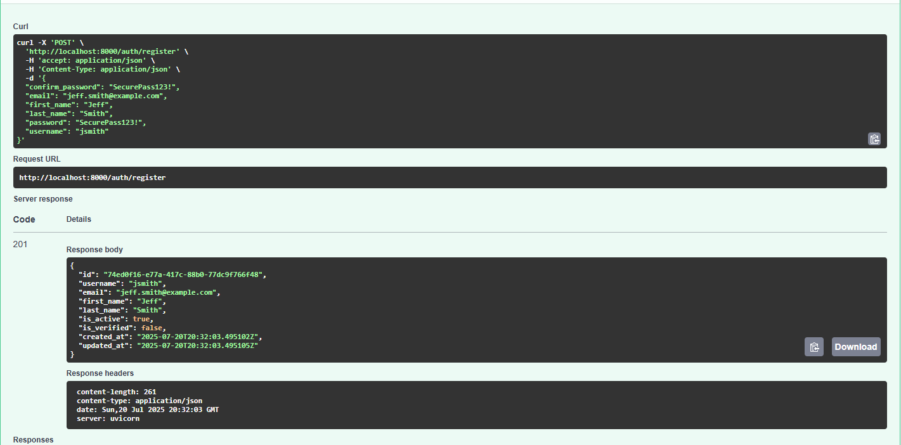
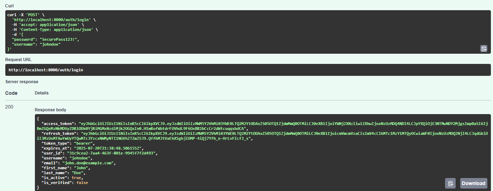
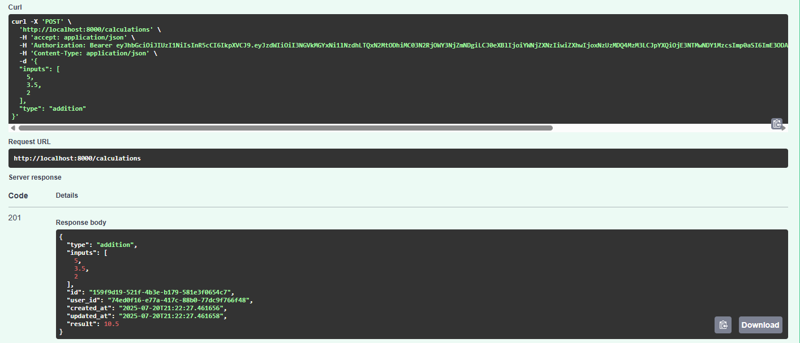
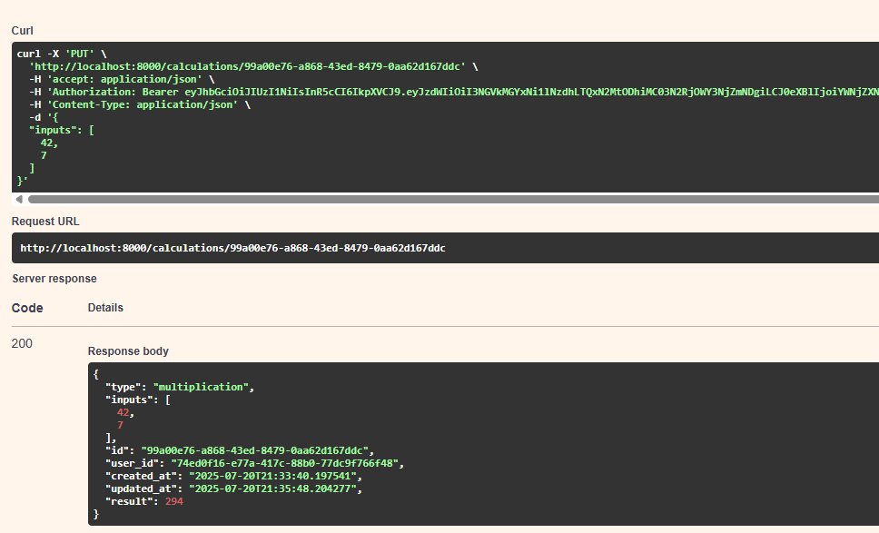
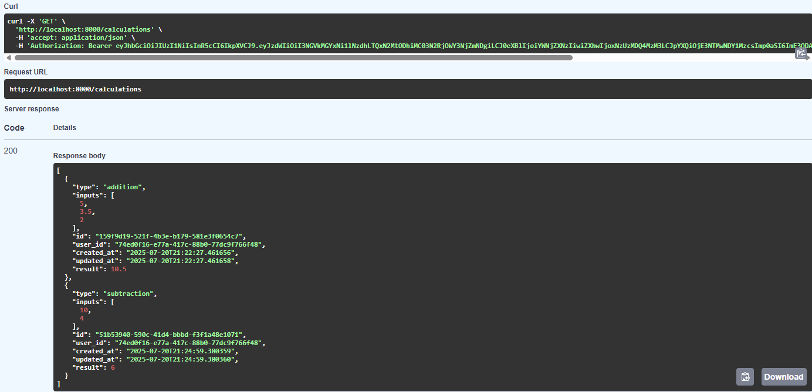
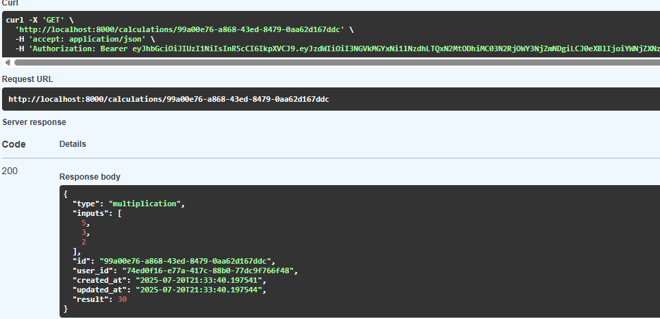
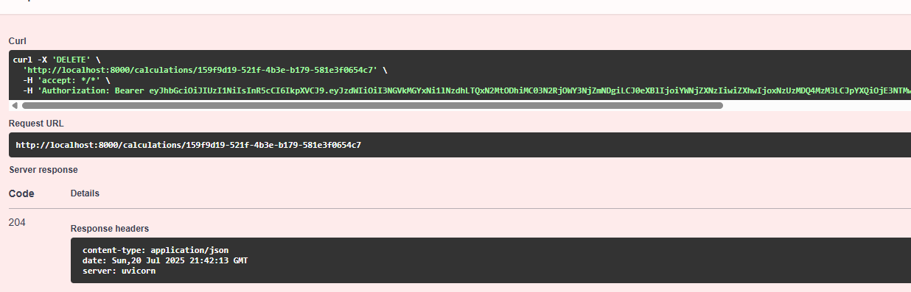

## Module 12 Assignment

Testing Commands
```
pytest # to run all tests
pytest -s -v # for more verbose output
pytest --preserve-db # to preserve the database between tests
pytest --run-slow # to run slow tests
pytest tests/integration # to run integration tests
```

[Docker Hub Link ](https://hub.docker.com/repository/docker/tdeans/module12/general)

Registration Example


Login Example


Create Calculation Example


Update Calculation Example


Get Calculation by User Example


Get Calculation by ID Example


Delete Calculation Example
